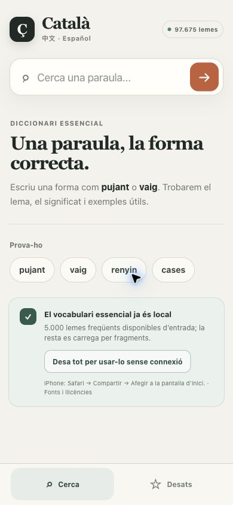
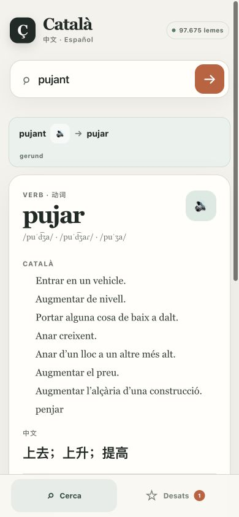
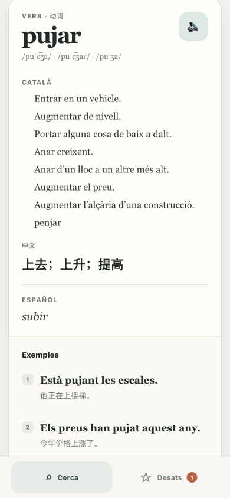
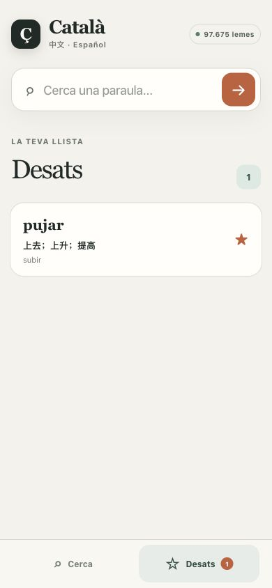
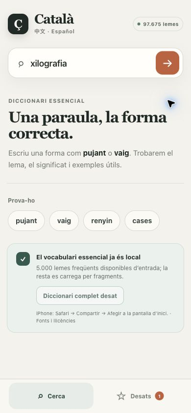

# Català — 随身字典

[English](README.md) · 中文 · [Español](README.es.md)

笨人来巴塞罗那留学，但是 Català 水平很烂，遂做了个加泰罗尼亚语／中文／西班牙语
三语对照字典，方便自己查词。欢迎大家取用！

支持词形查询、发音、收藏和离线使用，手机上也能安装。约有 9.7 万个加泰语词条；
中文释义目前仅覆盖一小部分人工整理的词条。

## 打开和查词

[打开字典](https://catalan-dictionary-pwa.vercel.app)，直接在浏览器里使用，无需注册或登录。



*首页：上方查词，下方的 Cerca 是搜索页，Desats 是收藏页。*

1. 在搜索框输入**加泰语单词或词形**。
2. 按 **Enter** 或点击右侧 **→**。例如输入 `pujant`，字典会找到原形 `pujar`。
3. 查看已有的释义、词形信息和例句。如果出现 **Altres coincidències possibles**，可以点击其他候选结果。




*词形查询示例：pujant → pujar。向下滚动可看翻译、例句和收藏按钮。*

目前以加泰语查词，**不支持中文或西语反查，也不是整句翻译工具**。
不是每个词都有完整三语释义、音标和例句；有些词只有加泰语或英语释义。

尽量保留重音符号。比如 `coneixer` 会提示 `conèixer`，点击建议再查看。
找不到词时，可以检查拼写、重音，或试试单词原形。

## 发音、收藏和历史

- 点击 **🔊**，使用设备或浏览器提供的语音朗读。必要时在设备的语音设置中下载加泰语声音；发音质量和离线朗读能力因设备而异。
- 在词条上点击 **☆ Desa** 收藏，按钮会变成 **★ Desat**。
- 点击底部 **Desats** 查看收藏；点击词条重新查词，点击星号移除收藏。
- 点击 **Cerca** 返回首页；**Recent** 是最近成功查过的词，点击即可重查；**Esborra** 只清空查词历史，不删除收藏。



*收藏保存在当前设备的当前浏览器里。*

没有账号同步或内置导出功能。清除网站数据可能删除收藏、历史和已下载词库；
隐私模式也可能阻止保存。**收藏一个词不等于下载完整离线词库**，点击收藏仍会重新查词。

## 准备离线使用

首次打开时先保持联网，等待初始准备完成。常用的约 5,000 个词条会自动保存在本地，
其他词条在联网查询时按需加载。要离线使用完整词库：

1. 返回 **Cerca**，找到 **Desa tot per usar-lo sense connexió**（下载完整离线词库）。当前线上版本有查词历史时会隐藏入口，可以先点 **Esborra** 清空历史；收藏仍会保留。
2. 点击下载，保持页面打开。压缩词库约 **15 MB**，还需要给应用和浏览器存储留一些额外空间。
3. 等按钮变成 **Diccionari complet desat**（完整词库已保存）后，再断网使用。
4. 如果下载中断，恢复联网后重新点击下载，会接着处理还没保存的部分。



*看到“Diccionari complet desat”，表示完整词库下载完成。*

离线使用需要在**同一个浏览器**里先准备好应用和词库。浏览器可能清理本地存储，
出门前最好检查一次。词库版本更新后，先联网打开，再重新下载新版本。

## 安装到手机或电脑

- **iPhone / iPad：** Safari → 分享 → 添加到主屏幕 → 添加。如果出现“作为网页 App 打开”开关，保持开启。
- **Android Chrome：** 地址栏旁的菜单 → 安装和创建快捷方式 → 安装，跟随提示操作。
- **电脑 Chrome：** 点击地址栏的安装图标，或在菜单的“投放、保存和分享”里寻找“将网页安装为应用”。其他浏览器的入口可能不同。

菜单名称和是否显示安装入口，取决于系统与浏览器版本。安装是可选的，
**安装应用不会自动下载完整离线词库**。
也可参考官方的 [Apple 安装说明](https://support.apple.com/guide/iphone/iphea86e5236/ios)、
[Android Chrome 说明](https://support.google.com/chrome/answer/9658361?co=GENIE.Platform%3DAndroid&hl=zh-Hans)
和[电脑 Chrome 说明](https://support.google.com/chrome/answer/9658361?co=GENIE.Platform%3DDesktop&hl=zh-Hans)。

## 常见问题

使用较新的浏览器。词条加载失败时，恢复联网并刷新；没有结果时，检查拼写或改查原形。
收藏或下载失败时，检查剩余空间，并避免使用隐私模式。没有声音时，检查设备安装的语音。

仍有问题可[提交 Issue](https://github.com/easonlines2007/catalan-dictionary/issues)，说明设备、浏览器和查的词，避免附上个人信息。

## 本地运行

使用 **Node.js 22**：

```bash
git clone https://github.com/easonlines2007/catalan-dictionary.git
cd catalan-dictionary
npm ci
npm run dev
```

打开 [localhost:3000](http://localhost:3000)。要测试生产模式，先停止开发服务器，
执行 `npm run build`，再运行 `npm start`。页面离线缓存在生产模式启用，断网刷新应在这个模式下测试。

验证：`npm test`、`npm run lint`、`npm run typecheck`。

应用代码采用 [MIT 许可](LICENSE)，词典数据保留各自的原许可：
[来源与署名](DATA_SOURCES.md)。[隐私说明](PRIVACY.md)。
